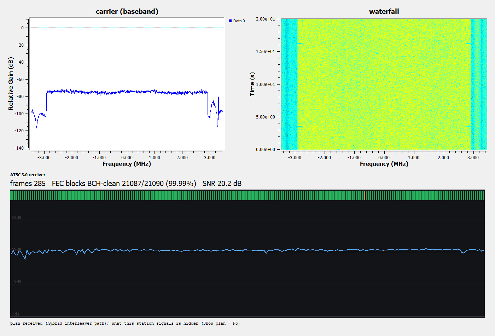
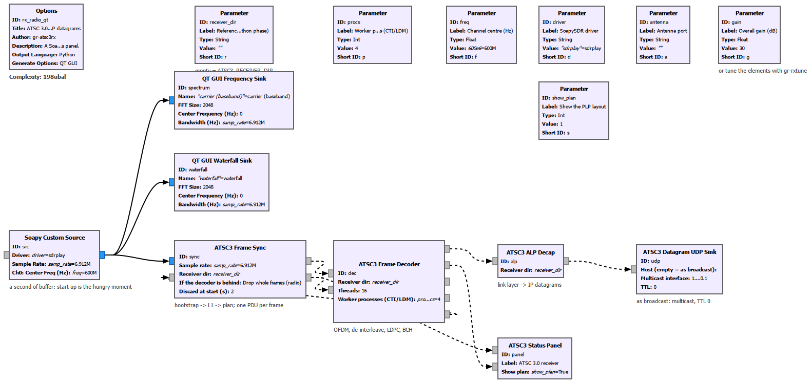

# gr-atsc3rx

**An ATSC 3.0 (NextGen TV) physical-layer receiver for GNU Radio. Complex baseband in, IP
datagrams out.**

GNU Radio has had a complete ATSC 3.0 *transmitter* for years
([drmpeg/gr-atsc3](https://github.com/drmpeg/gr-atsc3)). It has never had the other half -
not for ATSC 3.0, and not for its cousin DVB-T2 either. This is the other half.

> **Status: Python phase (0.1).** The blocks below work end to end - on captures **and on live
> air** - and are held **bit-exact** against a reference receiver that decodes live television.
> But in this phase they *call* that receiver's code rather than re-implementing it, so you need
> it installed, and only hybrid-interleaver multiplexes run faster than real time. Stages move to
> C++ one at a time, each only after it passes the same gate. `docs/TEST_REPORT.md` says exactly
> what has and has not been run; `docs/DESIGN.md` has the plan; `docs/PRIOR_ART.md` the field.



*`examples/rx_radio_qt.grc` on an SDRplay and an indoor antenna: every frame's FEC blocks
BCH-clean (the green strip), SNR read off the frame's known dummy cells. The plan readout is
switched off here - what a real station signals is that station's data, not this project's.*

## What it does

```
 complex samples ─► Frame Sync ─► Frame Decoder ─► ALP Decap ─► UDP / your application
                       │              │
                       │  ▲           └─ dial (SNR) + liveness (BCH-clean blocks)
                       │  └─ feedback: "that frame was weak" -> re-scan timing, or re-acquire
                       └─ plan
```



| Block | In -> out |
|---|---|
| **ATSC3 Frame Sync** | samples -> one PDU per frame. Finds the bootstrap, decodes L1-Basic / L1-Detail, builds the frame **plan from what is signalled** (never from the channel number), tracks timing at the signalled frame length, and re-acquires when the decoder says the frames are weak or the radio dropped samples. The plan rides in every frame's metadata, because in ATSC 3.0 the geometry arrives over the air - FFT size, guard interval, pilots and PLP layout can change per subframe. |
| **ATSC3 Frame Decoder** | frame -> baseband payload. OFDM demod, channel estimate, de-interleaving, soft demapping, LDPC, BCH. Publishes a **dial** that is continuous below the decode cliff (SNR off the frame's known dummy cells) and **liveness** that cannot be faked (BCH-clean block count) - both plug straight into [gr-rxtune](https://github.com/Felbs/gr-rxtune). |
| **ATSC3 ALP Decap** | baseband payload -> IPv4/UDP datagrams as PDUs. **GNU Radio's job ends here.** ROUTE, MMTP, the guide, audio and video belong to whatever consumes the datagrams. |
| **ATSC3 Datagram UDP Sink** | sends each datagram to the multicast group and port it was broadcast with, TTL 0 by default (it stays on your machine), so a ROUTE/MMTP stack or a packet capture sees the broadcast as if it had a tuner. |
| **ATSC3 Status Panel** | optional Qt panel: the plan, a per-frame FEC strip, the SNR trace, totals. |
| **ATSC3 Capture Source** | a raw IQ file as a stream that goes quiet, rather than ending the flowgraph, at end of file - message blocks still have frames in flight. |
| **ATSC3 Datagram File Sink** | the acceptance-test sink: writes and hashes datagrams in the reference receiver's dump format. |

`apps/atsc3_rx.py` - the whole receiver from the command line, capture or radio, with a status
line a second and datagrams out on UDP or to a file.

`examples/tv_bridge.py` - **watch television through it**: GNU Radio owns the radio and the whole physical
layer, and the baseband output feeds the reference receiver's transport and players (everything above IP is
deliberately not this project's). `--tv` gives picture **and sound**: tested on live air for 5 minutes -
720p60 HEVC video, AC-4 audio decoded in two languages, captions, all muxed and played by the reference
receiver's own viewer. Clear services only.

`apps/atsc3_identify.py` - point it at a capture or a SoapySDR device and in about two seconds
it prints what the carrier is transmitting: FFT size, guard interval, pilot pattern, frame
length, every PLP with its modulation and code rate, time-interleaver mode, LDM.

## It never decrypts

Some ATSC 3.0 services are protected (A3SA). This project does not implement, attempt, link to
or discuss circumventing that, and never will. It stops at IP datagrams and never touches a
content key.

## How it is tested

1. **Bit-exact against the reference receiver** (`util/gate_bitexact.py`): one capture through
   both; the datagram files must be the same bytes. Current result, both decode paths:
   hybrid interleaver 4150 / 4150 datagrams, convolutional interleaver + LDM pipeline
   12285 / 12285 - **sha256 identical**. A stage is not "ported" until this still passes.
2. **TX -> RX loopback against drmpeg/gr-atsc3** - its V&V flowgraphs run at 6.912 MS/s, our
   native rate, so they are a radio-free signal generator for every mode it can make.
   *Not yet run: it needs a C++ build environment (Linux).*
3. **Live air.** 100.00 % of FEC blocks BCH-clean over 45 s from the command line; 99.98 - 100 %
   over 50 - 75 s from the GRC flowgraph. One radio, one multiplex, short runs: see the report.
4. **Same-samples stress test** (`util/stress_ab.py`): the radio's samples are quantised once and fed to this
   chain and to the reference receiver, live, side by side. One hour: 1,077,217 of 1,077,218 FEC blocks here,
   1,077,440 of 1,077,440 there, no re-acquisition on either side, and **every one of this chain's 1,269,178
   datagrams byte-identical** to the reference's. The first run of this test is how a latent bug in the
   reference receiver's CPU path was found (and then fixed at its source): see the report.
5. **QA** with a fake reference receiver, so CI needs no receiver, capture or radio: 22 tests.

No captured broadcast content is, or ever will be, in this repository: test signals come from
the transmitter in (2); captures and their oracles stay on the machine that made them.

## Try it (Python phase)

```
export ATSC3_RECEIVER_DIR=/path/to/reference/receiver        # the directory containing lab/
python apps/atsc3_identify.py --capture some.cs16            # or --soapy "driver=..." --freq HZ
python apps/atsc3_rx.py --capture some.cs16 --udp             # or --soapy "driver=..." --freq HZ --gain ...
python util/gate_bitexact.py some.cs16 --oracle some.dg      # oracle = the reference receiver's --dump-dg
```

Nothing is compiled yet. From the source tree, `examples/_devpath.py` makes
`from gnuradio import atsc3rx` resolve here; for GRC set `GRC_BLOCKS_PATH` to this repo's `grc/`.

## Licence

GPL-3.0-or-later, the GNU Radio convention - which also lets later phases use the SIMD LDPC
engine from gr-dvbs2rx. The reference receiver is a separate project under Apache-2.0; code
flows from it into here, not back. Standards documents A/321 and A/322 are free downloads from
atsc.org. ATSC 3.0 is covered by third-party patents and patent pools that license makers of
end-user products; nothing here grants, or could grant, rights in those.

## Acknowledgments & prior art

- **[gr-atsc3](https://github.com/drmpeg/gr-atsc3)** (Ron Economos) - the transmitter, validated
  against the ATSC verification suite, and therefore the test bench for this receiver and an
  independent reading of A/322 to check ours against.
- **[gr-dvbs2rx](https://github.com/igorauad/gr-dvbs2rx)** (Igor Freire, Ahmet Inan, Ron
  Economos) - the pattern this module is built on: decode the frame's parameters at run time
  and *tag the frame with them*. Also the home of the LDPC engine we expect to use.
- **[xdsopl/LDPC](https://github.com/xdsopl/LDPC)** (Ahmet Inan) - SIMD batch LDPC decoding.
- **[gr-ieee802-11](https://github.com/bastibl/gr-ieee802-11)** (Bastian Bloessl) - CSI carried
  forward with the data, and PDUs from the framing layer up.
- **GNU Radio's in-tree DVB-T receiver** - the block split (acquisition, FFT, pilots/equaliser,
  demap) that every OFDM broadcast receiver inherits.
- **[libatsc3](https://github.com/kansonkong/libatsc3)** - for everything above IP.
